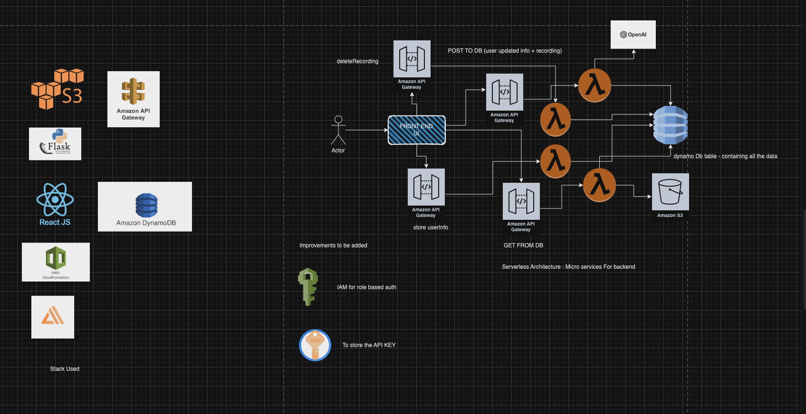
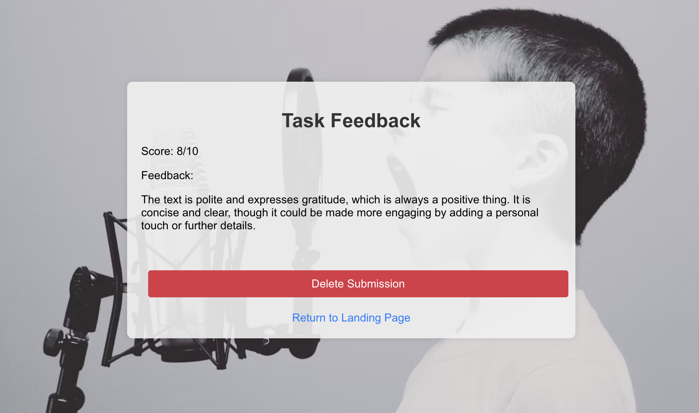

# Sales Simulation

An online platform allowing user to get the feedback on their sales pitch.

 
## Prerequisites
- IAM role with permissions (Amplify full access, dynamo db access, s3 access)
- Use an ubuntu t2.2xlarge config EC2 instance
- Administrator access for the Repo, which will be used later for adding the hosting

## How to deploy it  (Follow the commands as mentioned below)
- ```sudo apt update```
- Install nodejs by running the following command:
  - ```sudo apt install nodejs```
  - ```node -v```
- Install npm by running the following command:
  - ```sudo apt install npm```
  - ```npm -v```
- Install git:
  - ```sudo apt install git```
  - ```git -v```
- Install unzip:
  - ```sudo apt install unzip```
- Install aws cli:
  - ```curl "https://awscli.amazonaws.com/awscli-exe-linux-x86_64.zip" -o "awscliv2.zip"```
  - ```unzip awscliv2.zip```
  - ```sudo ./aws/install```
- Install amplify
  - ```curl -sL https://aws-amplify.github.io/amplify-cli/install | bash && $SHELL```
- Check python3 version:
  - ```python3 --version```
  - Should be 3.8.x
- Install pipenv
  - ```sudo apt install pipenv```
- Clone the repo.
- Go to ```amplify/``` and delete the ```team-provider-info.json``` file.
- Go one level up in the directory tree.
- Do ```amplify init```
  - Enter your ```access key id``` and Secret ```access key``` when prompted, whcih should be created with IAM Role creation as a prereq (with policies as AWS Amplify full access). Once role is created you should have the csv file with the credentials, use that to set up the cli.
- Do ```amplify push```  (This should deploy all the required resources)

### This will deploy all the backend environment for the project

## HOSTING THE FRONT END:
- Go to AWS console -> AWS Amplify
- Click on the newly created app within the AWS account
- Opening the app, click on hosting environment. 
- It would ask for connecting the repo, through, select GITHUB
- It will first authorize the aws with github, once successful, you should be able to connect the repo along with a specific branch (assuming you have the admin access for the repo)
- Select the name of the repo where the code is residing within the Github. T
- Enable Full CI/CD
- DOCKER IMAGE TO BE USED: 

```
version: 1
backend:
  phases:
    preBuild:
      commands:
        - export BASE_PATH=$(pwd)
        - sudo yum install -y gcc openssl-devel bzip2-devel libffi-devel wget tar make
        - wget https://www.python.org/ftp/python/3.8.2/Python-3.8.2.tgz
        - tar xzf Python-3.8.2.tgz
        - cd Python-3.8.2
        - sudo ./configure --enable-optimizations
        - sudo make altinstall
        - sudo ln -fs /usr/local/bin/python3.8 /usr/bin/python3
        - sudo ln -fs /usr/local/bin/pip3.8 /usr/bin/pip3
        - pip3.8 install --user pipenv virtualenv
        - export PATH=$PATH:~/.local/bin
        - cd $BASE_PATH
    build:
      commands:
        - '# Execute Amplify CLI with the helper script'
        - amplifyPush --simple
frontend:
  phases:
    preBuild:
      commands:
        - npm cache clean --force
        - npm ci --cache .npm --prefer-offline --legacy-peer-deps
    build:
      commands:
        - npm run build
  artifacts:
    baseDirectory: build
    files:
      - '**/*'
  cache:
    paths:
      - .npm/**/*
```

- Once done, then the build should be in queue and the entire application should be build and hosted end to end.
- Clicking on the link of the application, should help to take you to the hosted application.


## Known bugs and disclaimers

#### Some of the manual steps which needed to be followed to make the application working end to end.


### To make the application working end to end:
- We need to provide the access to the lambda functions to be able to access the speific policies, which could help them to access the resources.
- Search for all the lambdas which are created through the amplify command. As amplify automates the process, the roles created for the lambda execution are appended by some number so need to be searched in specific folders to get the exact name and attach the policies.
- Search for LambdaExecutionRole name within the codebase.
- Attach the required policies to that specific lambda role.
- Similarly, we have to go to all the functions which comes with the project setup ie populateuser, textract, translate, images, comprehend
- Policies to be attached are as follow:
```
AmazonDynamoDBFullAccess
AWSLambdaDynamoDBExecutionRole
AWSLambdaInvocation-DynamoDB
AmazonS3FullAccess
```
- Once attach the other manual step is to update the s3 bucket which is created by amplify push command, so go to AWS Console
- Search for s3, there should be a bucket named take2ais3bucket appended with some number along with the env, which should be dev, if you added followed the default prompt while setting up the application.
- The bucket should be publicly accessible.
- Push to the backend environemnt by doing amplify push or you can commit to the master (assuming master of the repo is connected), it should build all the resources again and update whatever is new or edited.
- This will ensure that entire application works end to end now.


## How to test/run/access/use it
1. Click on the link, which should be available on the AWS amplify if wanted to work/test the hosted application functionality.
2. For testing the application locally, the backend environment will be using the resources hosted on AWS whereas you will be able to see the UI using localhost
3. For that go to the root of the directory in scan-writing, do ```npm install``` (assuming npm is installed in the system already)
4. Once npm install finishes, it should fetch all the required dependencies.
5. Do ```npm start```, it will launch the application on the browswer.


# Improvements (TODO):
<ul>
<li>Hard coded API key can be added within the key vaults</li>
<li>IAM roles can be enforced</li>
<li>API's can be further restricted down to use authentication - JWT tokens or IAM role based</li>
<li>Some API calls for store can be more fast, if broken down further - Forx : Open AI integration</li>
</ul>

### All these things mentioned above were bypassed because of the small scale of the project, and can be done if needed to add within production.

### Also, added a small demonstration of how this works which could be referred to below:


---

# Application UI

Here's a preview of how the application looks:

## Landing Page


## Task Page


## Recording bar


## Rendering bar


## Feedback Page


## Deleting Recording Feedback


---

# Getting Started with Create React App

This project was bootstrapped with [Create React App](https://github.com/facebook/create-react-app).

## Available Scripts

In the project directory, you can run:

### `npm start`

Runs the app in the development mode.\
Open [http://localhost:3000](http://localhost:3000) to view it in your browser.

The page will reload when you make changes.\
You may also see any lint errors in the console.

### `npm test`

Launches the test runner in the interactive watch mode.\
See the section about [running tests](https://facebook.github.io/create-react-app/docs/running-tests) for more information.

### `npm run build`

Builds the app for production to the `build` folder.\
It correctly bundles React in production mode and optimizes the build for the best performance.

The build is minified and the filenames include the hashes.\
Your app is ready to be deployed!

See the section about [deployment](https://facebook.github.io/create-react-app/docs/deployment) for more information.

### `npm run eject`

**Note: this is a one-way operation. Once you `eject`, you can't go back!**

If you aren't satisfied with the build tool and configuration choices, you can `eject` at any time. This command will remove the single build dependency from your project.

Instead, it will copy all the configuration files and the transitive dependencies (webpack, Babel, ESLint, etc) right into your project so you have full control over them. All of the commands except `eject` will still work, but they will point to the copied scripts so you can tweak them. At this point you're on your own.

You don't have to ever use `eject`. The curated feature set is suitable for small and middle deployments, and you shouldn't feel obligated to use this feature. However, we understand that this tool wouldn't be useful if you couldn't customize it when you are ready for it.

## Learn More

You can learn more in the [Create React App documentation](https://facebook.github.io/create-react-app/docs/getting-started).

To learn React, check out the [React documentation](https://reactjs.org/).

### Code Splitting

This section has moved here: [https://facebook.github.io/create-react-app/docs/code-splitting](https://facebook.github.io/create-react-app/docs/code-splitting)

### Analyzing the Bundle Size

This section has moved here: [https://facebook.github.io/create-react-app/docs/analyzing-the-bundle-size](https://facebook.github.io/create-react-app/docs/analyzing-the-bundle-size)

### Making a Progressive Web App

This section has moved here: [https://facebook.github.io/create-react-app/docs/making-a-progressive-web-app](https://facebook.github.io/create-react-app/docs/making-a-progressive-web-app)

### Advanced Configuration

This section has moved here: [https://facebook.github.io/create-react-app/docs/advanced-configuration](https://facebook.github.io/create-react-app/docs/advanced-configuration)

### Deployment

This section has moved here: [https://facebook.github.io/create-react-app/docs/deployment](https://facebook.github.io/create-react-app/docs/deployment)

### `npm run build` fails to minify

This section has moved here: [https://facebook.github.io/create-react-app/docs/troubleshooting#npm-run-build-fails-to-minify](https://facebook.github.io/create-react-app/docs/troubleshooting#npm-run-build-fails-to-minify)
